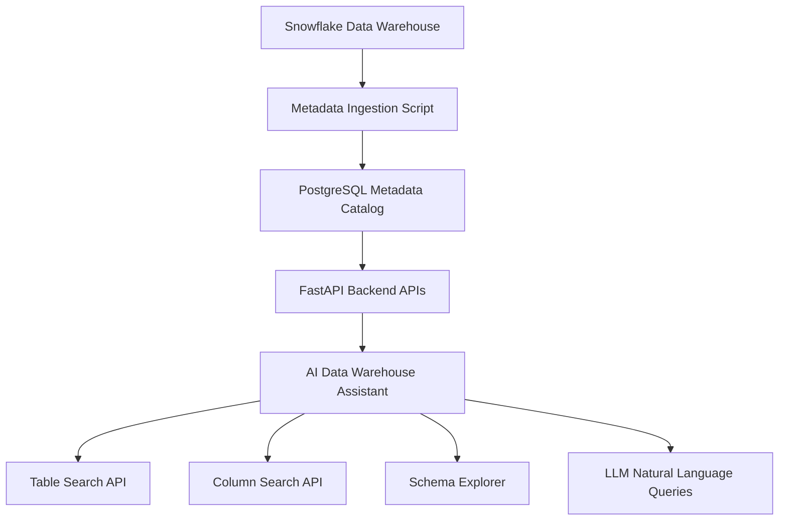

\# Automated Data Warehouse Assistant


AI-powered \*\*Data Warehouse Assistant for Snowflake\*\* — metadata ingestion, schema discovery, and natural language data exploration using FastAPI and PostgreSQL.


\---


\## Overview


Modern data warehouses often contain \*\*hundreds or thousands of tables\*\*. Engineers and analysts frequently struggle with questions like:


\- Which table contains a specific column?

\- What schema does this table have?

\- Which datasets are available in the warehouse?


This project builds a \*\*lightweight metadata catalog and AI assistant\*\* to solve those problems.


\---


\## Features


\### Metadata Ingestion


Ingests metadata from Snowflake:


\- databases

\- schemas

\- tables

\- columns


\### Metadata Catalog


Stores metadata in \*\*PostgreSQL\*\* for fast querying.


\### API Endpoints


Built using \*\*FastAPI\*\* to expose metadata services.


Example APIs:


```

/tables

/columns

/table-details?table\_name=TABLE

/columns/search?q=price

/ask?q=Which table contains customer\_id?

```


\### AI Assistant


Natural language interface that allows engineers to query metadata using LLMs.


Example queries:


```

Which table contains price?

Explain the schema of STOCK\_PRICES

```


\---


\## Architecture


```

Snowflake

&#x20;  │

&#x20;  │  metadata ingestion

&#x20;  ▼

PostgreSQL Metadata Catalog

&#x20;  │

&#x20;  │ FastAPI APIs

&#x20;  ▼

AI Data Warehouse Assistant

```


\---

## Architecture Diagram




## Demo

Example API queries:

### Get tables

```
GET /tables
```

### Search for columns

```
GET /columns/search?q=price
```

Example response:

```json
{
 "table_name": "STOCK_PRICES",
 "column_name": "PRICE",
 "data_type": "FLOAT"
}
```

### Ask AI assistant

```
GET /ask?q=Which table contains price?
```


\## Tech Stack


\- Python

\- FastAPI

\- PostgreSQL

\- Snowflake

\- OpenAI LLM

\- Git / GitHub


\---


\## Project Structure


```

automated-data-warehouse-assistant

│

├── backend

│   ├── app

│   │   ├── core

│   │   │   ├── config.py

│   │   │   └── db.py

│   │   │

│   │   ├── ingestion

│   │   │   └── snowflake\_ingest.py

│   │   │

│   │   ├── models

│   │   │   └── metadata.py

│   │   │

│   │   ├── services

│   │   │   └── llm\_service.py

│   │   │

│   │   └── main.py

│   │

│   ├── requirements.txt

│   └── .env

│

└── README.md

```


\---


\## Setup


\### Clone the repository


```

git clone https://github.com/saidwh99/automated-data-warehouse-assistant.git

cd automated-data-warehouse-assistant/backend

```


\### Create virtual environment


```

python -m venv venv

venv\\Scripts\\activate

```


\### Install dependencies


```

pip install -r requirements.txt

```


\---


\## Environment Variables


Create `.env`


```

SNOWFLAKE\_ACCOUNT=

SNOWFLAKE\_USER=

SNOWFLAKE\_PASSWORD=

SNOWFLAKE\_WAREHOUSE=

SNOWFLAKE\_DATABASE=

SNOWFLAKE\_SCHEMA=

SNOWFLAKE\_ROLE=


POSTGRES\_HOST=

POSTGRES\_DB=

POSTGRES\_USER=

POSTGRES\_PASSWORD=


OPENAI\_API\_KEY=

```


\---


\## Run Metadata Ingestion


```

python app/ingestion/snowflake\_ingest.py

```


\---


\## Run API Server


```

python -m uvicorn app.main:app --reload

```


Server runs at:


```

http://localhost:8000

```


\---


\## Example API Queries


\### Get tables


```

http://localhost:8000/tables

```


\### Search columns


```

http://localhost:8000/columns/search?q=price

```


\### Get table schema


```

http://localhost:8000/table-details?table\_name=STOCK\_PRICES

```


\### Ask AI assistant


```

http://localhost:8000/ask?q=Which table contains price

```


\---


\## Future Enhancements


Planned improvements:


\- data lineage detection

\- pipeline failure analysis

\- schema change detection

\- Slack notifications

\- dashboard UI

\- support for Databricks and BigQuery


\---


\## Why This Project Matters


This project demonstrates:


\- modern \*\*data platform architecture\*\*

\- metadata engineering

\- API design

\- Snowflake integration

\- AI-assisted data discovery

