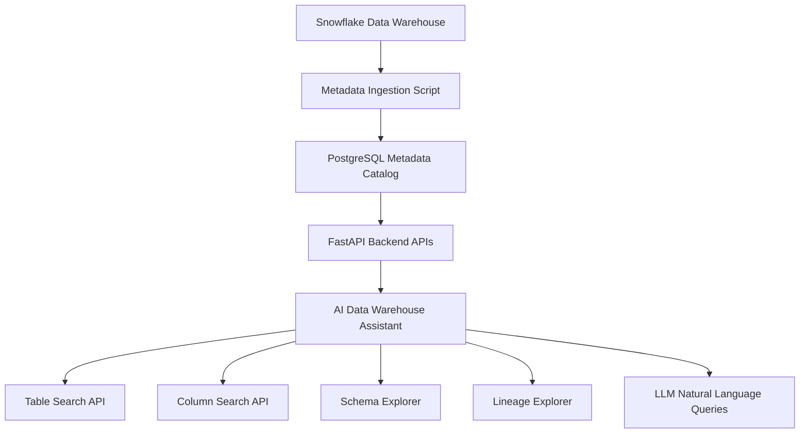

# Automated Data Warehouse Assistant

AI-powered **Data Warehouse Assistant for Snowflake** — metadata ingestion, schema discovery, lineage tracking, and natural language data exploration using FastAPI and PostgreSQL.

---

## Overview

Modern data warehouses often contain **hundreds or thousands of tables**. Engineers and analysts frequently struggle with questions like:

- Which table contains a specific column?
- What schema does this table have?
- Which datasets are available in the warehouse?
- What upstream or downstream tables depend on this dataset?

This project builds a **lightweight metadata catalog and AI assistant** to solve those problems.

---

## Features

### Metadata Ingestion

Ingests metadata from Snowflake:

- databases
- schemas
- tables
- columns

Metadata is extracted from:

```
information_schema.tables
information_schema.columns
```

---

### Metadata Catalog

All metadata is stored in **PostgreSQL** for fast querying.

Stored objects:

- tables
- columns
- schema metadata
- lineage relationships

---

### API Endpoints

Built using **FastAPI** to expose metadata services.

Example APIs:

```
/tables
/columns
/table-details?table_name=TABLE
/columns/search?q=price
/lineage?table_name=TABLE
/ask?q=Which table contains customer_id?
```

---

### Schema Explorer

Inspect a table schema.

Example:

```
GET /table-details?table_name=STOCK_PRICES
```

Example response:

```json
{
 "table_name": "STOCK_PRICES",
 "columns": [
   {
     "column_name": "SYMBOL",
     "data_type": "VARCHAR"
   },
   {
     "column_name": "PRICE",
     "data_type": "FLOAT"
   }
 ]
}
```

---

## Data Lineage

The system tracks **upstream and downstream relationships** between tables.

Example APIs:

```
/lineage/seed
/lineage?table_name=STOCK_PRICES
/lineage/explain?table_name=STOCK_PRICES
```

Example response:

```json
{
 "table_name": "STOCK_PRICES",
 "upstream_tables": ["RAW_STOCK_PRICES"],
 "downstream_tables": ["DAILY_STOCK_SUMMARY"]
}
```

This helps answer questions like:

- What tables feed this dataset?
- Which datasets depend on this table?

---

## AI Assistant

Natural language interface that allows engineers to query metadata using LLMs.

Example queries:

```
Which table contains price?
Explain the schema of STOCK_PRICES
Which tables feed CUSTOMER_DIM?
```

---

## Architecture



---

## Tech Stack

- Python
- FastAPI
- PostgreSQL
- Snowflake
- OpenAI LLM
- Git / GitHub

---

## Project Structure

```
automated-data-warehouse-assistant
│
├── backend
│   ├── app
│   │   ├── core
│   │   │   ├── config.py
│   │   │   └── db.py
│   │   │
│   │   ├── ingestion
│   │   │   └── snowflake_ingest.py
│   │   │
│   │   ├── models
│   │   │   └── metadata.py
│   │   │
│   │   ├── services
│   │   │   └── llm_service.py
│   │   │
│   │   └── main.py
│   │
│   ├── requirements.txt
│   └── .env
│
└── README.md
```

---

## Setup

### Clone the repository

```
git clone https://github.com/saidwh99/automated-data-warehouse-assistant.git
cd automated-data-warehouse-assistant/backend
```

---

### Create virtual environment

```
python -m venv venv
venv\Scripts\activate
```

---

### Install dependencies

```
pip install -r requirements.txt
```

---

## Environment Variables

Create `.env`

```
SNOWFLAKE_ACCOUNT=
SNOWFLAKE_USER=
SNOWFLAKE_PASSWORD=
SNOWFLAKE_WAREHOUSE=
SNOWFLAKE_DATABASE=
SNOWFLAKE_SCHEMA=
SNOWFLAKE_ROLE=

POSTGRES_HOST=
POSTGRES_DB=
POSTGRES_USER=
POSTGRES_PASSWORD=

OPENAI_API_KEY=
```

---

## Run Metadata Ingestion

```
python app/ingestion/snowflake_ingest.py
```

---

## Run API Server

```
python -m uvicorn app.main:app --reload
```

Server runs at:

```
http://localhost:8000
```

---

## Example API Queries

### Get tables

```
http://localhost:8000/tables
```

---

### Search columns

```
http://localhost:8000/columns/search?q=price
```

---

### Get schema

```
http://localhost:8000/table-details?table_name=STOCK_PRICES
```

---

### Query lineage

```
http://localhost:8000/lineage?table_name=STOCK_PRICES
```

---

### Ask AI assistant

```
http://localhost:8000/ask?q=Which table contains price
```

---

## Future Enhancements

Planned improvements:

- automatic lineage extraction from ETL mappings
- pipeline failure analysis
- schema change detection
- Slack notifications
- dashboard UI
- support for Databricks and BigQuery

---

## Why This Project Matters

This project demonstrates:

- modern **data platform architecture**
- metadata engineering
- API design
- Snowflake integration
- lineage modeling
- AI-assisted data discovery

---

## License

MIT License